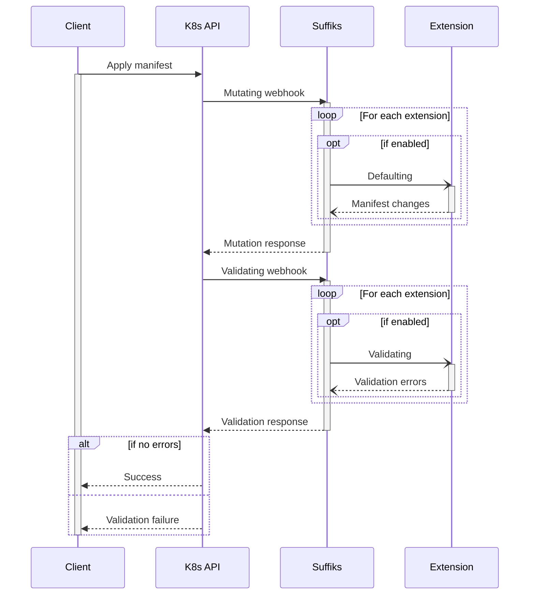

## Apply new manifest

```mermaid
	sequenceDiagram
		participant client as Client
		participant k8s as K8s API
		participant suffiks as Suffiks
		participant extension as Extension

		client->>k8s: Apply manifest
		activate client


		k8s->>suffiks: Mutating webhook
		activate suffiks
		loop For each extension
			opt if enabled
				suffiks-)extension: Defaulting
				activate extension
				extension--)suffiks: Manifest changes
				deactivate extension
			end
		end
		suffiks-->>k8s: Mutation response
		deactivate suffiks

		k8s->>suffiks: Validating webhook
		activate suffiks
		loop For each extension
			opt if enabled
				suffiks-)extension: Validating
				activate extension
				extension--)suffiks: Validation errors
				deactivate extension
			end
		end
		suffiks-->>k8s: Validation response
		deactivate suffiks

		alt if no errors
		k8s-->>client: Success
		else
		k8s-->>client: Validation failure
		end

		deactivate client
```
